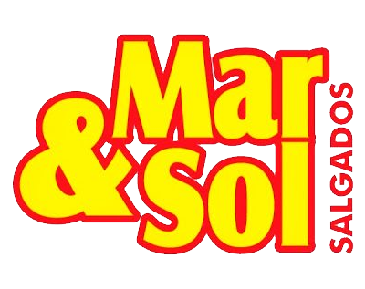

<h2 align="center"> Mar & Sol Salgados E-Commerce System </h2> 

<!-- Badges -->

<h4 align="center"> 
    <i> 🚧  Projeto em construção  🚧 </i>
</h4>

<!-- Descrição -->
<h3>Esse é um sistema de E-Commerce, onde o seu objetivo principal é a venda de salgados para restaurantes e lanchonetes. Está sendo feito com um objetivo pedagógico e ele será fornecido para a empresa <i> Martins & Araujo Ltda</i> após a sua conclusão </h3> 

O projeto está sendo desenvolvido por <i>Guilherme Araújo</i> e <i>Felipe Biava</i> como trabalho de conclusão de curso (TCC) de <i>Técnico em Informática</i> do <i>Centro Estadual de Educação Profissional (CEEP) - Pedro Boaretto Neto</i>. O projeto não apresenta fins lucrativos por parte de seus desenvolvedores e temos a autorização de usarmos imagens e logos da <i>Mar & Sol Salgados</i>.
 

<h3>Funcionalidades do projeto:</h3>

- `Vizualizar produtos`: O Usuário pode visualizar os produtos cadastrados no sistema além de seus ingredientes.
- `Sistema de Cadastro`: O Usuário pode se casdastrar no sistema para realizar compras, desde que ele tenha um CNPJ válido.
- `Carrinho de Compras`: Logado, o usuário pode adicionar produtos ao carrinho de compras, e depois pode efetua-la.
- `Monitorar Pedidos`: O Usuário pode monitorar os pedidos que ele fez e seu estado atual: Pendente - Aprovado - Encaminhado - Entregue - *Cancelado.    
*O pedido só será cancelado se o usuário não tiver pago em até 2 dias úteis ou se o mesmo cancelar manualmente.

<h3>Técnologias Usadas:</h3>

- `XAMMP 7.4.29`
- `PHP 8.1.5`
- `CSS3`
- `MySQL 8.0.21`
- `Bootstrap 5.2.0` 

<h3> Desenvolvedores: </h3>

| [ Guilherme Araújo](https://github.com/Guilherme-Araujo-Dev) |  [ Felipe Biava](https://github.com/Felip8)
| :---: | :---: |